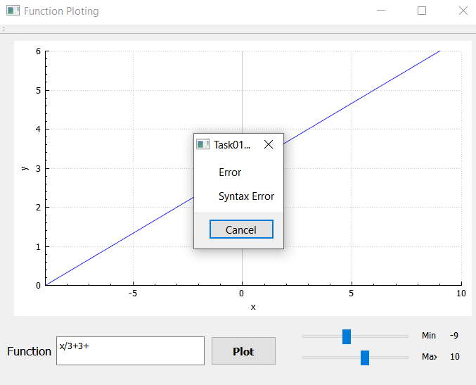

# Function Plotters

in this app a Qtc++ is used to create a GUI application to take a function, min and max value and then plot this function

## The UI Off The App Can Be Presented In This Image

## Features

### 1. The following operators are supported: + - / ^.

### 2. Input validation to the user input.

